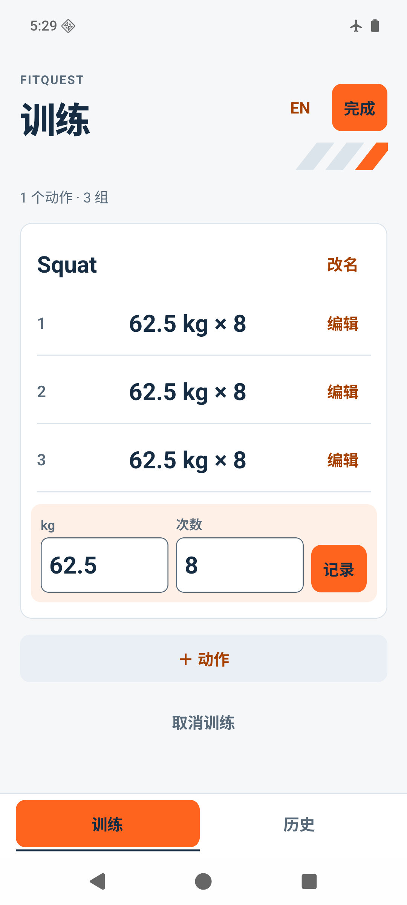
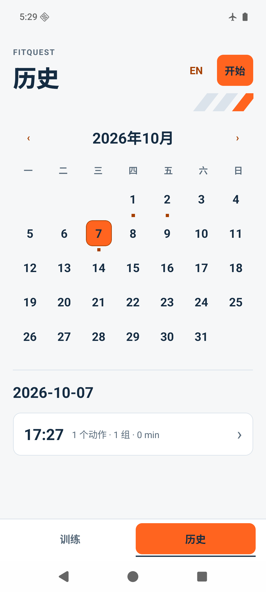

# 前端共创记录

## 2026-10-07 运动感与配色再共创（B 实际页面已确认保持）

用户确认截图展示合理，但进一步指出：“视觉感过于简洁 颜色搭配不是很让人有运动的欲望”。本轮据此准备两套视觉方向，不把反馈直接解释成某一新配色或布局已批准。

- [A 竞技红](/Users/qqqq/Documents/Codex/2026-09-12/gen/work/visual-direction-2026-10-07/A-竞技红.png)：冷白、竞技红、炭灰；更硬朗的字形、紧凑组表与有力度的数字。
- [B 能量橙](/Users/qqqq/Documents/Codex/2026-09-12/gen/work/visual-direction-2026-10-07/B-能量橙.png)：雾白、亮橙、蓝黑；用较明亮的色块与深色数字增强活力。

两稿使用相同示例训练与日历内容，保留浅底、行内录组、顶部完成、底部训练/历史及短文案；不新增卡路里、趋势环、AI建议或社交。内置图像生成产出，仅为视觉共创素材，iPhone外框不代表iOS已经运行。已检查两图，B日历29号字符修正后另存最终稿；精确颜色对比、字号/触控、各交互状态仍须代码实现与设备验证。完整提示与来源保存在[设计记录](/Users/qqqq/Documents/Codex/2026-09-12/gen/work/visual-direction-2026-10-07/design-record.json)。

用户最新原话：“B”。明确选择 B 能量橙，不自行混入 A 字体方向。落实雾白背景、亮橙主操作、蓝黑数字、局部斜线与紧凑录组；现有行内录组、顶部完成、底部双入口和日期点击保持。此选择只批准视觉方向及其落地细化，不代答 320dp 日历或 002 数据入口，也不代表所有设备细节通过。下轮以实际运行页面确认颜色强度、字号与密度；新证据另记，不沿用旧包结果。

本步学习验收：视觉层次与功能范围区别L1。练习指出哪一稿更有训练动力，并分别说明配色、数字或密度的具体原因；汇报“用户已选择 B 能量橙，正在将视觉方向落实到真实 App 页面”。难以判断时在相同训练行与日历区域对比；本人学习掌握待反馈。

### B 实现与验证

B已落实到真实训练、历史和共享控件：放大数字、浅橙输入区、局部斜线、蓝灰次操作与暗色状态标记。最终本地包`f3b396b26936`；153/19、类型/lint、双导出与构建通过，指定320dp/130%字号下录组/错误保留/编辑/保存和离线重启已检查。实际训练值展示沿用“62.5 kg × 8”，不把方向稿的kg/次数分列当作已新增操作。用户已确认保持当前数字大小与内容密度；未新增320日历/002批准。来源、源码指纹、局部原生证据与本步学习验收见[验证记录](../../specs/001-workout-session-loop/verification.md)。

下一轮已提问：“B 已落实到真实训练页和日历页。看这轮实际截图，训练页的数字大小与内容密度你更倾向哪一种？”选项为保持现在、再紧凑些、再有力量些；用户答复：“保持现在最好 同步更新github”。据此确认保持本轮真实页面的字号、配色和内容密度，并授权同步本项目至GitHub；不扩大为iPhone/所有设备、320日历方案或002入口批准。最终中英正常字号及320dp/130%字号共12张图的独立视觉审查未发现新增阻断裁切/重叠；未覆盖范围见[视觉审查](/Users/qqqq/Documents/Codex/2026-09-12/gen/work/theme-b-2026-10-07/visual-review.md)。

### 当前界面确认与 GitHub 同步

最新答复：“保持现在最好 同步更新github”。B 当前页面作为后续开发的视觉基线，不再反复询问同一配色/密度选择。以下是已确认的真实运行截图，使用合成数据、来自 Mac 上的 Android 模拟器；不是 iPhone 实测。

| 训练 | 历史 |
| --- | --- |
|  |  |

[English training](screenshots/2026-10-07/training-en.png) · [English history](screenshots/2026-10-07/history-en.png)。历史段落中的 `/Users/...` 链接是本机审计材料，GitHub不提供这些本地日志；仓库内截图与规格使用相对链接。

本步学习验收：版本同步与产品发布的区别L2。练习在GitHub找到本次代码提交和截图，再指出一个仍待iPhone验证的交互；可汇报“已确认B界面并将本地开发成果整理为可审查的版本同步”，只有远端哈希验证成功后才称同步完成。找不到时复习分支、提交与README导航；本人学习掌握待操作证明。

## 2026-10-02 工程状态

工程增量（2026-10-02）：沿用已批准浅色橙红及核心交互；字段/历史读屏语义、日期lookup、320dp训练键盘修复有各自证据。最新153项/19套、类型/lint、双平台JS/Hermes导出及4f6c66316bf5本地Android构建/签名/ZIP对齐通过；28项当前生产源码与隔离构建输入哈希一致。依赖未变，Doctor21/21沿用本日同版本证据，audit仍15项（11 moderate/4 high）。 保存迟到导航加mounted保护，历史在写入期间显示既有Loading并串行读取，属于现有契约修正，不是新增界面批准。

原生进度（2026-10-02）：最新4f6包已独立核验：保存期间历史Loading、无假读取错误/Retry，提交后不被迟到回执跳走，离线重启可读；原1002场及关联行逐值不变，仅新增两笔8次/62.5kg合成记录，触发器已清理。 044ab迟到导航专项已独立关闭，旧00aba1000场UI功能/滚动/返回选日已有独立图审；首窗口P95 298ms不证明完整交互，慢帧及软件渲染限制保留。旧版Q001–Q007/Q009、320dp及16KB结果不转绑4f6；16KB兼容模式禁用未证。Q008仅部分320dp训练键盘通过，TalkBack、实体/iOS和5位用户未完成。任务见[001 tasks](../../specs/001-workout-session-loop/tasks.md)，证据见[verification](../../specs/001-workout-session-loop/verification.md)。

320dp日历共创320dp日历共创（2026-10-02）：当前日期→详情与底部双入口沿用已批准结构；日历小屏A/B选择仍未收到具体答复，未增加批准。原生日历日期树中英顺序与功能通过不能替代小屏布局选择或TalkBack导航验收。此问题与下方002数据入口A/B是两次独立确认，互不代答。

本步学习验收（2026-10-02）：设计批准与设备证据边界L2。练习列出“核心导航已确认、训练键盘已局部验证、小屏日历仍待选择”三种不同状态，再说明无用户答复为何不能据技术测试通过直接实施新方案，及Busy等待态修正为何仍在既有契约内。汇报“按已确认设计修复了原生日期和训练键盘问题，小屏日历及数据入口继续共创”。未掌握时复看本节与Q008后重述；本人学习待实际操作和反馈。

002首轮共创（2026-10-02）：已向用户提出A历史页右上“数据”轻入口、B详情“数据说明”入口的选择问题；尚无答复，不记录新批准。002已收缩为随时查看的数据说明＋最小导出DRAFT；底部“训练/历史”不变，无第三tab或新dashboard，后续结构和交互轮仍须具体答复。仅合成数据，不开展小程序。以下已注明日期的原话与工程记录保留为历史。

工程增量（2026-09-26）：历史详情按既有方案加入“删除/Delete”及带训练时间的二次确认；取消无写入，失败留详情并重新确认，成功回原月/日更新标记。切语言不改变目标，跨页当前训练输入保留。146项自动测试/双平台资源导出通过；没有新增设计批准或真机视觉验收，下面9月23日状态保留为历史。

更新：2026-09-23。状态：**三轮核心设计共创已完成：浅色橙红、行内录组、底部训练/历史与月历、记录后收起键盘、完成/删除位置及确认流程均有实际用户答复。T004设计闸门通过；背景与内容丰富度后补，T029原生设备验收独立待办。**

工程接入：已按确认实现正式训练/纠错、保存摘要与只读月历，双语切换保留输入。记录成功请求收起键盘；完成先处理未录输入，名称未保存时禁止完成/重试；“先记录”请求定位并聚焦对应动作，编辑已录组保留手填下一组。130项自动测试和双平台JS/Hermes导出通过。未新增用户批准或以测试代替视觉/设备验收；历史删除仍未接入，原生软键盘、焦点、滚动和320布局待实际操作，背景丰富度仍按用户意愿后补。

用户当前要求：“前端界面需要与我确认多轮交互，不允许执行按传统 codex 的老传统 ai 味很重的界面来生成”。该要求优先于交接摘要中的旧执行建议。

## 确认顺序

| 轮次 | 提供给用户的材料 | 确认内容 | 当前状态 |
| --- | --- | --- | --- |
| 1 气质 | 浅色背景、橙色主操作、少量红色强调 | 活力与清爽同时满足；具体色值可在第三轮细化 | 已确认方向，见最新原话 |
| 2 结构 | 训练页 A 行内录组；底部 B「训练 / 历史」；历史以月历为主 | 日期标记、点击进入当天训练与详情、继续入口 | 结构与日历点击已确认 |
| 3 交互与视觉 | 日历与训练可点稿；自动收起键盘；完成/删除确认 | 核心点击流程与操作位置；背景与内容丰富度按用户要求后补 | 用户答复“顺手”，设计共创通过；320dp训练键盘已有局部模拟器证据，日历小屏/读屏仍待T029 |

每一轮须记录具体用户答复及调整，不用等待时间推定同意。聊天中的探索稿仅供比较，不写入产品路由；确认后再实现对应页面。若用户要求更多轮，继续迭代。

## 当前设计建议，尚未获批

本节原始建议仅作历史背景；已确认的颜色方向以文末用户原话为准。

- 围绕“健身房里快速记完这一组”组织训练页，使用真实中文和真实字段。
- 避免默认紫蓝渐变、玻璃卡片、多层圆角统计卡、装饰性趋势图、随机英文口号与 AI 图标。
- 不用首页仪表盘预支未实现的 XP、计划、趋势、会员或 AI 功能。
- 控件明确标注重量 kg、次数；空重量表示未记录负重，不能冒充徒手或 0 kg。
- 字段可读、操作目标足够大，320 宽度和键盘状态必须验收；危险操作仍需规格中的二次确认。

## 并行边界

允许继续：已批准001范围内的实现、修复、自动测试与合成数据设备验证；各任务由指定Agent独占对应文件写入，保留他人改动。

待具体答复后继续：320dp日历候选调整、002数据入口及其它未批准的新页面/交互。已批准的正式Expo页面与导航不重复申请；未回答不视为批准。产品发布、费用支付均未发生。

## 2026-09-13 第一轮材料

会话方向稿：`/Users/qqqq/.codex/visualizations/2026/09/12/01a09458-f74f-7bc3-9b97-5fd636ffcb4d/fitquest-direction-round-one.html`。仅使用合成训练记录，内存演示录组/完成确认，不保存数据、不接实际reducer、不是Expo页面。仅做气质比较；表格排列和流程都还待第二/三轮确认。此稿不视为任何轮次获批。

## 第一轮反馈与配色细化

用户原话：“训练页考虑颜色更积极正能量 深色 橙色 红色这些代表power”。

当时偏好：深色背景、橙/红强调、积极和力量感。此后用户明确指出黑底不够清爽，背景应以最新反馈为准。该反馈不等于批准页面结构或整套视觉细节。

调整稿：`/Users/qqqq/.codex/visualizations/2026/09/12/01a09458-f74f-7bc3-9b97-5fd636ffcb4d/fitquest-power-colors.html`。

- 默认炭黑背景、亮橙主按钮、少量红色强调；另可切换红色主导/橙色点缀。默认选项是设计建议，不视为用户已选。
- 放大训练重量/次数和主操作，输入区用深暖色区分；保留清楚的文字与单位。
- 当前只调整讨论稿的颜色与字级；正式Expo页面和业务逻辑未改动。交互仍为合成数据的内存演示，尚未真机验收。
- 当时待确认：主色比例及力量感。后续背景反馈见下一节，不再将深色视为已确定。

本步学习验收：视觉层级与强调色作用目标L2。练习说出第一眼看到的是哪个数字或按钮；若主操作不够突出，比较两版主色/对比度再调整。汇报口径：“已按用户反馈将训练页探索稿调整为深色橙红方向，页面结构和完整交互尚待确认。”学习掌握待用户给出可观察反馈。

## 黑底反馈与清爽版

用户原话：“现在的背景黑色又觉得不够清爽”。

据此调整：保留橙红强调及大数字，主体尝试浅灰白背景/纯白输入区域，另可比较纯白背景/浅灰输入区域。移除整条红色分隔线，以浅中性色区分区域；浅底小号强调文字用更深的橙红色维持可读性。

讨论稿：`/Users/qqqq/.codex/visualizations/2026/09/12/01a09458-f74f-7bc3-9b97-5fd636ffcb4d/fitquest-fresh-power.html`。旧稿保留用于回看。仅外观修改，演示交互不变，未开发正式页面；新的浅色选项是对反馈的设计提案，尚未获批。

本步学习验收（L2）：区分大面积背景和强调色各自对清爽感/力量感的作用。练习比较两种浅底，说明哪种更容易看清数字和输入区；若仍显压抑或层级不清，继续调整背景与分隔对比。当前汇报口径：“根据黑底反馈完成浅色橙红讨论稿，最终视觉与页面结构待确认。”

## 浅色方向确认与双语短文案

用户原话：“可以 其实要做两版本中/英文字尽量精简一下 不要用记录这一组这种看起来蠢蠢的长话 可以两个记录或者别的形式就好”。

确认范围：接受上一版浅色橙红方向；要求简体中文和英文两种界面，按钮采用简短、自然的动词。此答复不等于批准页面结构、键盘行为或完整流程。

讨论稿：`/Users/qqqq/.codex/visualizations/2026/09/12/01a09458-f74f-7bc3-9b97-5fd636ffcb4d/fitquest-bilingual.html`。

- 采用同一应用两种语言的实现方向，共用训练数据和业务规则；中文默认。中/EN 切换暂放讨论稿右上，正式入口位置待结构轮确认。
- “记录这一组”缩为“记录 / Log”；“完成训练”按钮缩为“完成 / Finish”；确认页保留“完成训练？ / Finish workout?”；“继续记录”缩为“继续 / Continue”。移除重复的训练提醒。
- 日期、预置示例“深蹲 / Squat”、字段、计数、反馈、确认和错误均提供两种文案。kg 保留；重量可选、范围和小数精度仍清楚。用户自行输入的动作名称将原样保留，不自动翻译。
- 切换语言的讨论稿代码只更新显示文字、无障碍标签与语言属性，不重建输入框、不重置已录组和当前确认状态。数据仍为内存合成示例；完成页与返回仅用于讨论，不代表实际保存或允许修改已完成记录。
- 正式双语要求已同步 spec FR-019、plan 和 tasks T033。现有领域层中文错误仍待 T033 改为稳定错误码并由界面翻译；没有宣称 App 双语功能已上线。

本步学习验收：短文案与双语界面的目标为 L2，语言切换验收为 L3。练习说明“记录”作用于一组而“完成”结束整场，并在讨论稿输入数值、切换 EN、触发错误、再切回中文，检查内容是否保留、提示是否看懂。可如实汇报：“已确认浅色橙红方向，提供双语精简文案讨论稿；正式页面和真机交互待实现与验收。”若按钮含义仍不清楚，回看字段和按钮位置后继续调整；学习掌握待实际操作反馈。

## 2026-09-14 第二轮：训练页结构

用户本轮要求：“继续今天的未完成工作”。从上一轮明确的续接点“训练页结构确认”继续；该请求不视为对未答复设计的批准。

讨论稿：`/Users/qqqq/.codex/visualizations/2026/09/12/01a09458-f74f-7bc3-9b97-5fd636ffcb4d/fitquest-workout-structure.html`。

- 顶部“完成 / Finish”作用于整场，橙色“记录 / Log”位于重量/次数下方。两种操作分开放置，维持上一轮短文案要求。
- 动作切换与“＋ 动作 / + Exercise”放在同一行；名称可自行输入和修改。预置深蹲示例有双语名，自填名称不自动翻译。
- 默认先看已录组，再填下一组；提供“输入在前”的结构比较。切换排列调整真实元素顺序，使键盘焦点顺序随排列一致，不通过 CSS 视觉顺序伪装。
- 每组旁边提供编辑入口，复用重量/次数输入区；编辑时主按钮为“保存 / Save”，显示删除与取消。完成、取消整场、删除组和放弃未提交输入各有独立确认内容。
- 切换语言沿用输入元素；操作状态与数值保存在讨论稿内存。完成后的简略结果和“重新体验”只用于共创；未写入产品代码或数据库，也不代表 FR-012 的完整持久化摘要已实现。
- 尚待用户答复：已录组与输入区的上下顺序、完成位置、添加动作/编辑入口是否顺手。首页与历史入口结构后续补充，第三轮重点验收小屏、键盘和误触。本轮没有声明三轮确认完成。

核对范围：读回讨论稿文字和代码、核对中英文字典与作用范围、检查文档 diff。没有执行浏览器、原生模拟器或真机流程；未运行业务测试，因为本次没有改动 `apps/mobile/`。

本步学习验收：页面结构验收目标 L2。按“录 1 组 → 编辑该组 → 添加卧推 → 切换 EN → 完成后继续”的清单操作，指出最难找到的入口，并解释“记录”和“完成”的不同范围。汇报口径：“已提供训练页结构交互讨论稿，正在收集布局反馈；正式 App 和持久化未实现。”若不能顺利完成，回到本稿调整入口和排列后重复；学习是否掌握仍待真实反馈。

## 2026-09-14 竞品学习反馈（研究，不是设计批准）

用户要求：“下一步你上网搜索市面上主流的类似app 总结学习反馈”。研究六款代表产品 Strong、Hevy、训记、Fitbod、JEFIT、Keep；来源、七条定性反馈、成本判断与学习验收见 [竞品学习记录](COMPETITOR_LEARNING_2026-09-14.md)。本轮依据官方说明、商店信息和评论，未安装实测；图片访问未完成可视核对。

研究后的候选调整：在现有独立输入区方案之外，提供行内录组比较；减少组编辑的操作往返、压缩页头、将改名归入动作菜单，比较整场动作列表的可见性。保持浅色橙红与短文案方向。跨场“上次表现”、动作库、模板和计时等仍属后续候选，需要另行确认范围。资料证明市场已有这些模式，不证明我们的版本更好。

当前状态不变：第二轮等待用户实际操作反馈，T004 未完成；未改动讨论稿或 apps/mobile，未把竞品行为直接写成已获批要求。

## 2026-09-16 第二轮续：行内与独立输入区对比

用户在研究后要求“采纳反思 继续开始下一阶段任务实现 尽可能的从开始就要对标主流爆款app”，并再次要求继续未完成工作。授权继续实现与比较；没有新的具体布局选择。

对比稿：`/Users/qqqq/.codex/visualizations/2026/09/12/01a09458-f74f-7bc3-9b97-5fd636ffcb4d/fitquest-logging-comparison.html`。通过会话调节项选择“A · 行内录组”或“B · 独立输入区”，可调320–390宽。默认A仅为展示起点，不代表用户批准。

- 两版共用同一份内存合成数据与输入节点，切换布局不清空数值。A把下一组放在表格内，编辑时直接在目标行填入；B沿用独立输入区。
- 保留已确认浅色橙红、短中英文案、顶部整场“完成”、组“记录/保存”与必要确认，压缩页头。图标编辑入口有具体组次读屏标签；控制目标至少48逻辑像素。
- 仍可加动作、改名、改组、删组、切换语言与完成确认。此为共创演示，未接生产reducer、SQLite或Expo；不是完整App，刷新不保留。
- 本轮仅语法检查和源代码核对。尝试浏览器预览时，本地服务绑定被环境权限拒绝，文件URL随后被浏览器安全策略拦截；未绕过。没有把桌面/真机交互、焦点、320布局或软键盘效果标为验证通过。

待用户本轮操作：录1组 → 编辑第1组 → 切EN → 完成后点继续；比较A/B并说明哪个入口不顺手。选定训练结构后继续首页/历史入口，第三轮再核实小屏、键盘和误触。

本步学习验收：布局判断L3、双语状态验收L2。证明练习为上述对比操作并说出选择理由，而非只看配色。汇报：“已形成两种录组结构提案，基础纠错代码已验证，具体界面仍待共创确认。”若无法区分记录一组与完成整场，回看按钮位置和确认内容后重试；学习状态待本人证明。

## 2026-09-16 用户确认 A 行内录组

本轮明确答复：“A：行内录组，直接在组列表中输入和修改”。据此确定训练页采用行内录组；不再重复询问A/B。该答复只确认训练录组结构，不扩大为首页、历史入口、所有细节或真机键盘已批准。下一轮材料围绕首页与历史路径，继续保留短中英文案与浅色橙红方向。

## 2026-09-16 第二轮续：首页与历史入口

讨论稿：`/Users/qqqq/.codex/visualizations/2026/09/12/01a09458-f74f-7bc3-9b97-5fd636ffcb4d/fitquest-home-history.html`。

- 首页方案A（建议）：主操作“开始/继续”，下方最近训练，“全部”进入历史。方案B：保留最近训练，增加底部“训练/历史”入口。使用会话调节项比较，尚未获批；本轮A/B只指首页，训练页行内录组的既有选择不变。
- 提供已有历史、首次打开、正在训练三种演示状态。历史按日期展示，可进入只读详情；删除需要确认。可切中/EN，名称作为用户输入原样保留。
- 简化的训练过渡页只为试走开始、返回首页、继续和完成后查看的路径，不是替代已确认训练稿的新方案；没有在此重复实现改名/改组/删组。完整训练交互仍以已确认行内方案继续第三轮。切动作保留未录数值，完成前未录输入需记录或清空；这是讨论行为，非正式页面验收。
- 合成数据只存在本讨论稿内存，刷新不保留；切“使用状态”重新载入示例。未绑定真实 reducer、保存服务或 SQLite。只读回源码并检查脚本语法，不声称已完成浏览器、320小屏、读屏或原生键盘验收；没有重试先前被策略拒绝的浏览器路径。

本轮待答复：首页“开始＋最近训练”和底部“训练/历史”双入口哪种更顺手。可按“打开历史 → 看详情 → 返回首页 → 开始 → 返回首页 → 继续”试走，再比较入口。随后第三轮聚焦行内输入、键盘、误触、错误及最终视觉。

本步学习验收：导航取舍L3、确认边界L2。操作上述路径并解释所选首页的理由；若找不到继续入口，回到两种结构重复比较。汇报：“训练行内方案已确认，首页/历史结构继续共创，尚未接真实存储。”材料交付与用户学习/设计批准分开记录。

## 2026-09-16 用户选择 B，并偏好历史总览

用户原话：“B「底部训练／历史 我个人目前使用训记 我觉得可以每次打开都总揽历史使用的数据更是我”。这是用户自身习惯反馈，不作为已经实测训记界面的证据。

明确采纳：固定底部「训练 / 历史」双入口，训练录组继续使用已选A。根据用户希望每次打开总览历史的表述，本轮提案默认进入历史页。没有把底部B的选择扩大成具体日历、趋势或统计功能已获批。

新稿：`/Users/qqqq/.codex/visualizations/2026/09/12/01a09458-f74f-7bc3-9b97-5fd636ffcb4d/fitquest-history-first.html`。旧首页对比稿保留作历史材料，新稿不再提供首页A/B选择。

- 默认进入历史：日期、时长、动作/组数及动作名称、每组重量/次数展开显示；可用调节项比较展开与精简密度。展开明细是当前工作假设，尚未获具体反馈。
- 历史页有小型“开始”；已有进行中训练时替换为清楚的“进行中 / 继续”，已有草稿不被新建。空历史保留开始入口。
- 点训练日期进入完整只读详情；完成和取消后可返回历史。底部训练入口保留，原行内训练方案不因本轮改选。
- 仍是合成数据内存讨论稿。语言切换和示例切换沿用前稿方式；未创建原生页面、查询真实数据库或处理App冷启动。正式实现前还需确认前后台恢复：建议正在输入时保留现场，不因恢复前台强制跳回历史，第三轮再确认。

已异步询问用户更偏好“最近训练明细 / 日历总览 / 数据趋势”。未答复时只推进上述明细提案；日历和趋势不自动加入001（当前规格明确推迟趋势图和训练量分析）。本轮仅核对源码、脚本语法和文档一致性，不声称浏览器/设备验收；未修改或重跑67项业务测试。

本步学习验收：信息优先级取舍L3。在新稿找到上次深蹲重量，进入详情，再回历史并进入训练；说明是否需要日历或汇总才能回答自己的问题。若仍需来回找，继续调整密度和入口后重试。汇报：“已确定底部双入口，历史优先首屏在共创中。”选择已有用户依据，具体界面验收与学习掌握待实际反馈。

静态审查结果：可交付讨论，无重要阻塞问题；1项Minor（切英文后根区域读屏名称仍为中文）已改为随语言更新。源码语法检查通过，git diff --check通过。界面重建输入节点，因此只说明值保存在讨论稿状态中，不宣称焦点或软键盘保持；这些仍须第三轮设备观察。

## 2026-09-16 用户明确选择日历总览

用户原话：“整体要倾向于日历形式点进去可以看具体内容”。这条答复取代上一轮“先展开最近训练明细”的工作假设，也已经回答了总览类型问题，不再重复询问明细/日历/趋势。

采纳范围：历史首屏以月历为主要结构，有训练的日期有标记，点击日期查看训练内容。保留底部训练/历史、短中英文案、浅色橙红和行内录组。只增加已完成历史的日期导航，不引入计划日程、补录过去日期、趋势、连续打卡或新数据实体。

新稿：`/Users/qqqq/.codex/visualizations/2026/09/12/01a09458-f74f-7bc3-9b97-5fd636ffcb4d/fitquest-calendar-history.html`。固定合成示例从2026年9月显示，初始选中15日：15日两场、13日一场、8月30日一场。使用状态可切空历史/进行中，周一或周日开头可比较。演示按香港时区分日，正式产品按设备当前本地日期显示，存储UTC时间不改写。

交互提案（不是已获用户逐项批准）：单场日期直接进入详情；多场日期在月历下列出当天训练，按完成时间倒序并显示时间；无记录日期显示“当天无训练”，不冒充休息日。查看详情后返回保留月份和选日；删除一场更新当天列表和日期标记；完成一场后回历史定位到完成日期。历史页开始/继续操作仍针对当前训练，不将选中的过去日期作为新训练时间。

已将日历方向同步到spec FR-013、US2验收和T021/T022计划。T004仍等待点击细节和第三轮，T011原生宿主/SQLite状态不变；本轮未改业务源码或重跑67项测试。讨论稿完成不代表产品日历已实现。320宽的七列日期目标约45px，其他按钮至少48px；不能用此静态CSS替代iOS/Android原生触摸与读屏验收。

本步学习验收：日期导航与信息层级L3。点13日查看单场，再点15日选择其中一场，返回后切上月看30日，说明哪一步仍多余；若找不到内容，调整点击路径后重试。汇报：“历史已确定月历方向，可点稿正在验证日期到详情的路径。”学习掌握和最终交互批准仍待本人反馈。

月历稿核对：主Agent脚本语法检查通过；独立只读审查未发现Critical/Important，可交付讨论。审查保留320宽日期目标约44.9px、语言切换重建节点的已知限制。未运行浏览器/DOM或业务测试，不能据此宣称焦点、键盘、Android触摸或真机通过。后续设备验收补充quickstart Q-009。

## 2026-09-16 日历交互获认可，视觉丰富度后补

用户原话：“顺手 交互体验不错目前阶段背景填充和整体页面内容比较单薄 后续再补充”。据此确认当前日期到详情路径，包括单场直达、多场先选与返回月历；不再重复要求确认相同路径。反馈中的背景填充和页面内容单薄记为后续打磨项，本轮不增加画面内容。

第二轮结构确认完成；T004仍需训练页行内输入、小屏/键盘与误触的第三轮讨论，不能把日历体验反馈当作所有原生行为已验证。T004是设计共创，T029才是宿主接入后的设备验收；不会要求在Expo尚未创建时先证明原生键盘通过。视觉丰富度后补不作为当前纯逻辑推进的阻塞。

下一轮重点：键盘打开时记录/保存与完成的可达性、切动作/语言时未提交输入的保留、取消与删除的防误触。已询问主要测试手机平台/型号，未答复时保留未知，不据此猜测iOS或Android设备。

本轮同时提前实现T021/T022的纯日历日期投影，12项新测试连同原有测试共79项通过；不改讨论稿，不绑定真实页面。前端设计产物状态与业务代码状态分开记录。

本步学习验收：导航取舍L3已有明确用户判断；本地日期分组L2仍需操作证明。解释UTC时间在香港跨日但原记录不变，并运行README的完整命令；说不清时复看日历首项测试再做。可汇报：“日历交互获用户认可，日期逻辑已验证，背景打磨和原生输入体验继续推进。”

## 2026-09-16 第三轮：行内输入、收起键盘与误触

用户要求：“继续下一轮设计”。沿用已确认结构，本轮仅共创训练输入局部，不重新选择录组方式、导航或日历；不补充背景装饰和额外页面内容。

讨论稿：`/Users/qqqq/.codex/visualizations/2026/09/12/01a09458-f74f-7bc3-9b97-5fd636ffcb4d/fitquest-inline-keyboard.html`。

待确认的提案：

- 默认记录一组后收起键盘，下一组沿用本场刚才的重量与次数；这不是跨场历史复用。会话调节项可比较“收起键盘 / 连续输入”，宽度320–390，以及示意键盘显示。新增输入与整场完成继续分别使用“记录 / Log”和“完成 / Finish”。
- 重量、次数直接在行内输入，当前字段有浅橙底与边框。示意键盘上的“下一项 / Next”切次数，“上一项 / Previous”返回重量，收起按钮只结束输入焦点。键盘 Enter 在重量栏前往次数，在次数栏提交当前组；Escape收起。
- 编辑入口留在已录行，编辑时原地换成输入，主按钮改为“保存 / Save”，删除和取消在行下。正在修改一组时，先保存或取消再改另一组；新增组的临时输入独立保留，编辑完成后恢复。
- 切动作在各动作间保留未提交数值；切语言保留数据和同一对输入节点。新增动作与改名归入动作右侧菜单。用户输入的名称原样显示，不自动翻译。
- 完成前检查所有动作的未提交输入；提供“先记录 / Log first”回到对应输入，或明确“放弃输入 / Discard input”后再确认完成。整场无有效组不能完成；有其他有效组时允许保留空动作，与现有领域规则一致。正在新增或改名时先保存/取消名称，整场完成暂不可点。
- 删除组和取消整场各有确认；默认焦点放在返回/继续，危险确认使用红底白字。记录按钮在提交后短暂禁用650ms，用于讨论连点防护；不宣称实际原生事件/保存幂等已验证。

本稿只展示训练局部，未重新实现底部导航或替换已批准日历；原全局结构继续保留。合成数据仅在内存，刷新不保留；完成页标注“讨论稿 · 未保存 / Preview · Not saved”。与正式reducer、SQLite、系统键盘均未绑定。

示意键盘开启时，字段使用inputmode=none，点击数字键或实体键盘均可录入；关闭示意时恢复decimal/numeric输入提示。没有预设用户手机系统/型号。稿件采用自适应高度，不模拟设备可视高度或真实键盘压缩，因此**不能用它证明键盘遮挡、小屏滚动、平台触控/读屏、焦点恢复或前后台行为通过**。这些属于T029接入宿主后的设备验收。当前只确认操作规则及布局意图，T004仍等待实际反馈。

建议本轮操作：直接记录预填第3组 → 再点重量修改 → 切卧推再回深蹲检查输入 → 编辑并保存第1组 → 切EN → 点完成并先处理未录输入 → 在完成确认点继续。也可试删除后返回、取消训练后继续、320宽与连续输入选项。核心待答复为“记录后收起键盘”与“连续输入”哪个符合实际训练节奏。

本步学习验收：输入状态区分L2、任务操作验收L3。解释未提交输入、已录组、整场完成三者的区别，并走通上述操作；若误点完成或找不到恢复入口，指出具体一步并调整后重试。可汇报：“训练输入第三轮已提供可点讨论稿，键盘行为待用户选择及真机验收。”产物交付不代表用户学习或T004已通过。

第三轮静态核对：HTML读回、46个ID唯一且描述/标签引用完整；提取脚本的node --check通过。审查提出的空动作完成限制已按领域规则移除；编辑/删除末组后，只有未手改的预填跟随末组更新，手填草稿连同原比较基准保留，直至记录或明确放弃。对当前稿真实纯函数直接核对4种状态（手填值恰等于新建议、明确放弃、未手改跟随末组、删空后清空未改预填）通过；这些是讨论稿状态核对，不增加或重跑正式79项测试。仍无浏览器/DOM/原生验证。

独立只读复查最终结论：Ready to proceed = Yes（仅讨论稿）；当前Critical/Important/Minor均0。审查员重新检查当前脚本语法并独立复核上述4种状态，均通过。已发现的限制继续保留：没有实际DOM、浏览器、软键盘、滚动或真机证据，用户本轮选择仍待答复。

## 2026-09-16 用户确认记录后自动收起键盘

用户原话：“自动收起键”。结合上一轮二选一问题，明确采纳记录成功后自动收起键盘；不再重复询问收起或连续输入。现有讨论稿移除“记录后”比较选项并固定收起行为，宽度与示意键盘调节保留。

下一组仍保留刚记录的重量与次数，必须再次点击记录才新增；校验失败时保留原输入并聚焦错误字段，不提前收起。这些沿用上一稿的行为，收起选择不改变有效性校验和完成确认。下一步只继续核对整场完成入口与误触，不把本次选择扩大为全部布局、焦点、软键盘或设备已验收。T004尚未勾选，T029设备证据仍待。

本轮仅删除讨论稿的一项候选配置及其备用分支，未改生产代码或新增依赖，未重跑79项业务测试。静态核对脚本语法与文档差异；不新增重复业务测试，不声称浏览器/真机已验证。

本步学习验收：L2理解成功后收起与校验失败保留输入的区别；试录一组，再输入0次触发错误，检查数值能否直接修改。若不符合预期，回到该输入步骤调整后重试。可汇报：“用户已选定自动收起键盘，讨论稿已固定规则，原生接入待验收。”设计选择已确认，学习掌握仍待操作证明。

## 2026-09-16 完成/删除交互确认，设计闸门收尾

上轮明确问题：“‘完成／删除’的位置和确认流程是否也顺手？”用户答复：“顺手”。结合已确认的自动收起键盘与前两轮结构/视觉反馈，核心设计三轮已有真实答复，T004完成，允许开始T011宿主接入；不再重复询问这些选择。

采纳边界：训练按行内录组、顶部整场完成、组编辑下方删除与相应确认实现；已有日历与底部双入口保持。背景和页面内容丰富度按用户明确要求后补。此处通过的是可点讨论稿中的设计取舍，320宽度、真实键盘遮挡、触控尺寸、读屏和前后台恢复须T029独立观察，不能因设计确认宣称设备通过。

本步学习验收：设计确认与工程验收的区别L2。说明为什么“顺手”足以确定交互方向，但仍需在真实设备检查遮挡与持久化；若混淆，分别列出一个已确认选择和一个未验证行为再复习。可汇报：“核心界面三轮共创完成，开始Expo工程接入，视觉丰富度和设备验收继续推进。”
