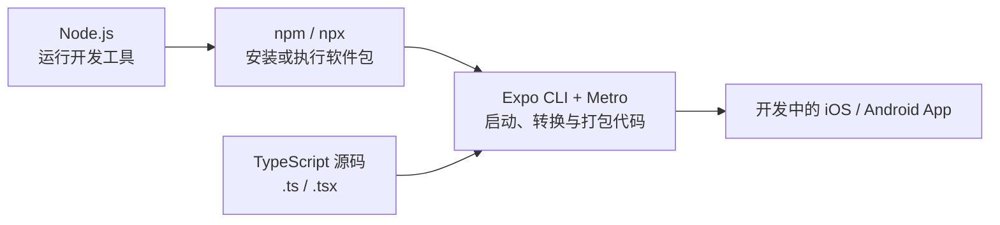
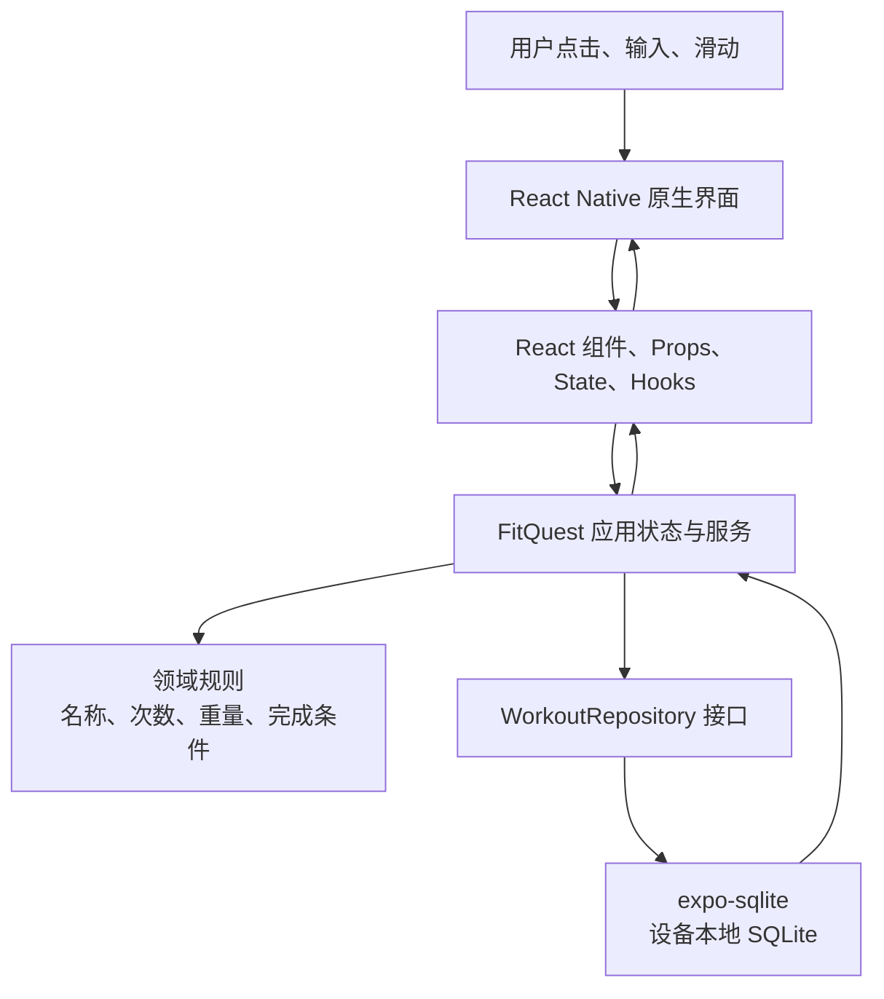
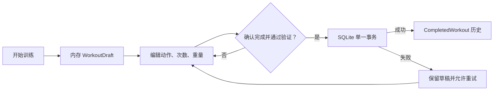
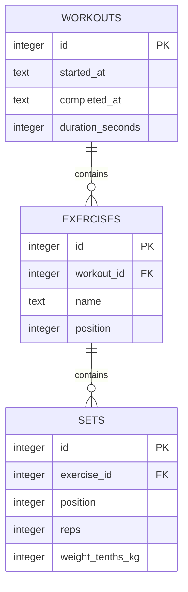
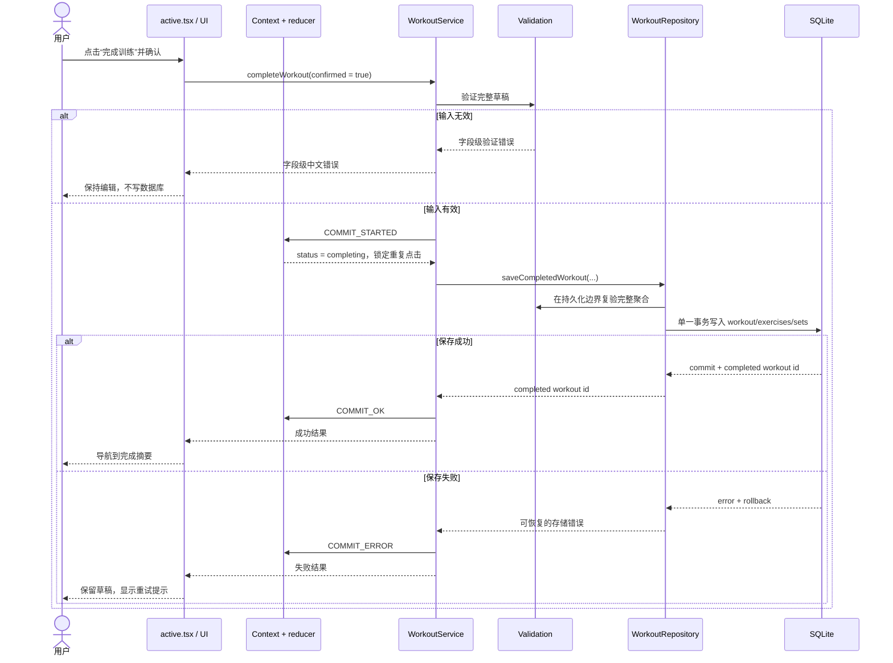

# FitQuest 移动端技术栈基础

> 状态：学习基线 v1.0
>
> 最近核对官方资料：2026-08-09
>
> 适用范围：`specs/001-workout-session-loop/` 训练记录最小闭环

这份手册回答三个问题：每项技术是什么、为什么 FitQuest 需要它、你需要掌握到什么程度。它不是通用编程百科，也不是要求产品负责人立刻成为资深移动端工程师。

2026-09-17进度：`apps/mobile/`、任务清单、纯逻辑、Expo配置及SQLite迁移/保存/详情适配已实现，105项自动测试通过；原生页面与设备验收待做。下文保留早期教学示例，实际进度和运行方法以移动端README及规格verification为准，示例不等同于已交付界面。

## 1. 先建立完整心智模型

### 1.1 开发电脑上的链路



- **Node.js** 是 Mac 上运行 JavaScript 开发工具的环境。
- **npm** 管理项目依赖和脚本；**npx** 临时执行某个 npm 软件包提供的命令。
- **Metro** 读取项目文件，把 TypeScript/JavaScript 及资源整理成设备能加载的 bundle。
- `npx expo start` 启动的是开发服务器和工具界面，不是 FitQuest 的线上业务后端。

### 1.2 App 内部的链路



一句话记忆：

> TypeScript 描述并检查代码；React 组织界面与状态；React Native 把界面渲染为移动端原生控件；Expo 提供项目框架、开发工具和原生能力；Expo Router 管页面；SQLite 管设备内的已完成训练。

## 2. 技术栈总表

| 技术 | 它负责什么 | 在 FitQuest 中做什么 | 它不是什么 |
| --- | --- | --- | --- |
| JavaScript | 程序运行时语言基础 | 事件、函数、数组、异步操作等底层语法 | 不是数据库或 UI 框架 |
| TypeScript | 在代码运行前做静态类型检查 | 描述训练、动作、训练组、状态和接口 | 不能代替运行时输入验证 |
| React | 用组件和状态声明“界面现在应是什么样” | 训练编辑器、错误提示、摘要等组件状态 | 不直接提供 iOS/Android 控件 |
| React Native | 用 React 编写跨平台原生移动界面 | `View`、`Text`、`TextInput`、`Pressable`、`FlatList` | 不是把网页放进 WebView |
| Expo | React Native 上层的应用框架与工具链 | 创建项目、开发服务器、SDK 模块、诊断、构建衔接 | 不等于 Expo Go，也不只是云服务 |
| Expo Router | 文件式页面路由与导航 | 首页、进行中训练、完成摘要、历史列表和详情 | 不处理训练业务规则或数据库 |
| React Context + `useReducer` | 管理当前训练草稿和状态转换 | `idle → active → completing → completed/error` | 不是永久存储 |
| `expo-sqlite` | 访问设备本地 SQLite 数据库 | 原子保存和读取已完成训练 | 不是云同步或多人数据库 |
| Jest | 执行自动化测试和断言 | 领域函数、reducer、服务等测试 | 不能证明真机原生行为 |
| `jest-expo` | 为 Expo 项目配置 Jest 环境 | 让 Expo/RN 模块更适合在测试环境运行 | 不是另一套测试框架 |
| React Native Testing Library | 按用户可观察行为操作组件 | 输入次数、点击完成、观察错误提示 | 不替代完整真机验收 |
| EAS Build / Submit | 云端构建与应用商店提交流程 | 后期生成 iOS/Android 安装包和辅助提交 | 第一条离线记录切片暂时不需要 |

## 3. Node.js、npm、package.json：开发工具的地基

### 3.1 Node.js 是什么

浏览器可以运行 JavaScript；Node.js 让 JavaScript 也能在浏览器之外运行。FitQuest 的开发电脑使用 Node 来运行 Expo CLI、Metro、TypeScript、Jest 和各种检查工具。

最重要的区分是：

- **开发时的 Node**：运行构建和测试工具。
- **手机里的 App**：运行打包后的应用逻辑和原生模块。
- **业务后端 Node 服务**：当前第一条切片没有后端，也没有账号或网络 API。

因此，看到终端里有 Node，不代表我们已经建了服务器。

### 3.2 npm 和 npx 是什么

- `npm install`：按 `package.json` 下载依赖。
- `npm run test`：执行 `package.json` 中命名为 `test` 的脚本。
- `npx expo start`：从项目依赖中找到 Expo CLI 并运行它。
- `package.json`：项目依赖、脚本和元信息的清单。
- `package-lock.json`：锁定实际安装版本，使不同机器的安装结果尽量一致。
- `node_modules/`：下载到本地的依赖目录，通常不提交到 Git。

作为产品负责人，你至少要能打开 `package.json`，分辨：运行依赖、开发依赖、可执行脚本和版本约束。

官方资料：

- [Node.js Introduction](https://nodejs.org/en/learn/getting-started/introduction-to-nodejs)
- [npm 官方简介](https://docs.npmjs.com/about-npm)
- [npm package.json 说明](https://docs.npmjs.com/cli/configuring-npm/package-json)

## 4. JavaScript 与 TypeScript：程序语言和安全网

### 4.1 为什么不能跳过 JavaScript

React Native 官方把 JavaScript 基础列为前置知识。第一次学习至少需要掌握：

- `const` / `let`、字符串、数字、布尔值、`null`。
- 对象和数组。
- 函数与箭头函数。
- `if`、三元表达式、`map`、`filter`、`reduce`。
- `import` / `export` 模块。
- `Promise`、`async` / `await`。
- 不可变更新：用新对象/数组表示变化，而不是直接改旧状态。

不用先学浏览器 DOM、jQuery 或复杂后端知识。我们优先学习会直接出现在 FitQuest 中的语言部分。

### 4.2 TypeScript 是什么

TypeScript 是 JavaScript 的静态类型检查器。“静态”表示检查发生在代码运行之前。它帮助开发者及早发现“这里预期数字，却传了字符串”“这个状态没有这种 action”等问题。

FitQuest 示例：

```ts
type WorkoutStatus = 'active' | 'completing' | 'error';

interface DraftSet {
  localKey: string;
  reps: number;
  weightTenthsKg: number | null;
}
```

这段代码表达：

- `WorkoutStatus` 只允许三个明确值。
- `reps` 在代码中必须是数字。
- 重量可以是数字，也可以是 `null`，表示徒手或未记录重量。

但 TypeScript **不会**自动阻止用户在输入框里键入 `abc`，也不会自动保证次数在 1–999。输入框给程序的内容通常仍是字符串，必须经过运行时解析和领域验证：

```ts
function parseReps(input: string): number | null {
  const value = Number(input);
  return Number.isInteger(value) && value >= 1 && value <= 999
    ? value
    : null;
}
```

这是必须牢记的边界：

- **类型检查**防止开发者在代码内部错误连接数据。
- **运行时验证**防止用户输入、数据库内容或网络数据违反业务规则。

官方资料：

- [TypeScript Handbook](https://www.typescriptlang.org/docs/handbook/intro.html)
- [Everyday Types](https://www.typescriptlang.org/docs/handbook/2/everyday-types.html)
- [Object Types / Interfaces](https://www.typescriptlang.org/docs/handbook/2/objects.html)
- [MDN JavaScript Guide](https://developer.mozilla.org/en-US/docs/Web/JavaScript/Guide)

## 5. React：组件、Props、State 与 Hooks

### 5.1 React 解决什么问题

传统思维是“找到某个控件，再手动修改它”。React 思维是：给定当前数据和状态，声明界面应该显示什么；状态变化后，React 重新计算并更新需要变化的部分。

一个组件本质上是返回界面描述的函数：

```tsx
type SetSummaryProps = {
  reps: number;
  weightTenthsKg: number | null;
};

export function SetSummary(props: SetSummaryProps) {
  return (
    <Text>
      {props.reps} 次 · {props.weightTenthsKg === null
        ? '徒手'
        : `${props.weightTenthsKg / 10} kg`}
    </Text>
  );
}
```

你需要理解五个词：

1. **Component（组件）**：可组合的界面单元，例如 `SetEditor`。
2. **Props（属性）**：父组件传给子组件的只读输入。
3. **State（状态）**：组件需要记住、并会影响界面的数据。
4. **Event（事件）**：用户点击或输入后发生的信号。
5. **Render（渲染）**：React 根据 props 和 state 计算当前界面。

### 5.2 State 为什么不是普通变量

普通局部变量不会在两次渲染之间可靠保留，也不会通知 React 更新界面。State 既保存当前值，又通过 setter 或 dispatch 触发重新渲染。

简单、彼此独立的状态可用 `useState`。FitQuest 的训练草稿涉及多个有关联的事件和状态，使用 `useReducer` 更容易集中表达规则。

### 5.3 `useReducer`：把状态变化写成可检查的规则

```ts
type Action =
  | { type: 'START'; startedAt: string }
  | { type: 'ADD_SET'; exerciseKey: string; set: DraftSet }
  | { type: 'COMMIT_STARTED' }
  | { type: 'COMMIT_OK'; completedWorkoutId: number }
  | { type: 'COMMIT_ERROR'; message: string };

function workoutReducer(state: WorkoutState, action: Action): WorkoutState {
  switch (action.type) {
    case 'COMMIT_STARTED':
      return { ...state, status: 'completing' };
    case 'COMMIT_OK':
      return {
        ...state,
        status: 'completed',
        draft: null,
        completedWorkoutId: action.completedWorkoutId,
      };
    case 'COMMIT_ERROR':
      return { ...state, status: 'error', error: action.message };
    default:
      return state;
  }
}
```

Reducer 是纯函数：相同的旧状态和 action 应得到相同的新状态，不直接写数据库、不跳转页面、不弹系统提示。这样它非常容易测试。

### 5.4 Context：让一组页面共享同一个训练草稿

Context 负责把当前 state 和 `dispatch` 提供给需要它们的组件，避免每一层都手工传 props。它不是数据库；应用进程被系统终止后，内存 Context 会消失。

我们选择 Context + `useReducer`，是因为第一条切片只有一个进行中训练，状态规模可控。现在引入 Redux、Zustand 等状态库只会增加学习和维护成本，没有新增用户价值。未来若状态边界明显扩张，再依据证据复查。

官方资料：

- [React：第一个组件](https://react.dev/learn/your-first-component)
- [React：State 是组件的记忆](https://react.dev/learn/state-a-components-memory)
- [React `useReducer`](https://react.dev/reference/react/useReducer)
- [React `useContext`](https://react.dev/reference/react/useContext)
- [React：更新 State 中的对象](https://react.dev/learn/updating-objects-in-state)

## 6. React Native：同一种 React 思维，渲染原生移动控件

### 6.1 React 和 React Native 的区别

React 规定组件、props、state、hooks 等界面组织方式，但不规定最终渲染到哪里：

- React DOM 常把 `<div>`、`<button>` 渲染为网页 DOM。
- React Native 用 `<View>`、`<Text>`、`<Pressable>` 等组件对接 iOS/Android 原生界面能力。

所以 React Native 不是普通网页，也不是把网页塞进一个壳。它使用 JavaScript/TypeScript 描述界面，但用户看到和操作的是移动端原生组件体系。

### 6.2 FitQuest 会用到的核心组件

| React Native 组件 | FitQuest 用途 |
| --- | --- |
| `View` | 布局容器、卡片、训练组行 |
| `Text` | 动作名称、次数、错误、摘要 |
| `TextInput` | 输入动作、次数和重量 |
| `Pressable` | 开始、添加组、完成、删除 |
| `ScrollView` | 内容量可控的滚动页面 |
| `FlatList` | 历史训练等可能变长的高效列表 |
| `KeyboardAvoidingView` | 避免软键盘遮挡输入与关键操作 |
| `Alert` 或项目对话框 | 完成/取消/删除确认 |
| `StyleSheet` | 创建可维护的样式对象 |

### 6.3 与网页开发不同的地方

- 不能随意使用 `<div>`、`<span>` 或网页 CSS。
- 布局主要使用 Flexbox，但默认值和网页不完全相同。
- 必须考虑触摸目标、软键盘、安全区域、Android 返回键和不同屏幕尺寸。
- 无障碍属性、读屏标签和数字键盘提示属于产品行为，不只是“美化”。
- iOS 和 Android 可以共享大部分代码，但必要时可使用平台专用文件或逻辑。

官方资料：

- [React Native Introduction](https://reactnative.dev/docs/getting-started)
- [React Native Core Components and APIs](https://reactnative.dev/docs/components-and-apis)
- [React Native React Fundamentals](https://reactnative.dev/docs/intro-react)
- [React Native Flexbox](https://reactnative.dev/docs/flexbox)
- [React Native Accessibility](https://reactnative.dev/docs/accessibility)

## 7. Expo：围绕 React Native 的应用框架和工具链

### 7.1 Expo 为我们减少了什么工作

只使用裸 React Native 时，开发者更早面对 Xcode、Android Studio、原生项目配置和不同平台依赖。Expo 在 React Native 上提供：

- 项目模板和 Expo CLI。
- 一组版本相互兼容的 Expo SDK 模块。
- 开发服务器、二维码连接和 Fast Refresh。
- Expo Router 等约定式能力。
- 配置插件、开发构建、诊断和更新能力。
- 与 EAS Build/Submit 等托管服务的衔接。

这很适合个人开发和边做边学：先把精力集中在产品闭环、React 和数据设计上，同时保留以后接入原生能力和上架的路径。

### 7.2 Expo、Expo Go、Development Build、EAS 的区别

| 名称 | 作用 | FitQuest 何时使用 |
| --- | --- | --- |
| Expo | 整套开源框架、CLI、SDK 和工作流 | 从第一天开始 |
| Expo Go | 官方预先构建的通用测试客户端，只含它预装的原生模块 | 早期快速学习和兼容能力验证 |
| Development Build | 为 FitQuest 自己构建的开发版 App，可包含项目需要的原生模块 | 项目复杂后或 Expo Go 不再满足时 |
| EAS | Expo Application Services，包含云构建、提交、更新等服务 | 真机分发、测试和上架阶段按需使用 |
| Production Build | 给最终用户安装、准备提交商店的正式二进制 | 上架里程碑 |

一个常见误解是“用了 Expo 就只能用 Expo Go”。实际 Expo Go 只是学习/快速测试工具；成熟项目通常会使用自己的 development build 和 production build。

### 7.3 Expo SDK 的版本必须成套理解

Expo SDK、React Native、React、Node 和测试预设之间存在兼容矩阵，不能分别追求“最新”后随意组合。

当前批准的计划基线是：

- Expo SDK 56。
- React Native 0.85。
- React 19.2.3。
- Node.js 20.19.x 或兼容的更新版本。
- TypeScript 5.x，具体版本由模板锁定。

这是一份 **规划基线**。Expo 官方文档当前已经进入后续 SDK 的切换期，因此真正创建 `apps/mobile/` 当天还要重新检查：模板是否仍可用、Expo Go 是否兼容、测试依赖是否匹配，并把最终版本锁进 `package-lock.json`。这不是推翻架构，而是正常的依赖风险管理。

官方资料：

- [Expo 文档总览](https://docs.expo.dev/)
- [Expo Tutorial](https://docs.expo.dev/tutorial/introduction/)
- [Expo Workflow Overview](https://docs.expo.dev/workflow/overview/)
- [Expo FAQ](https://docs.expo.dev/faq/)
- [Expo Development Builds](https://docs.expo.dev/develop/development-builds/introduction/)
- [EAS Build Introduction](https://docs.expo.dev/build/introduction/)

## 8. Expo Router：文件位置就是页面地址

Expo Router 是文件式路由。`src/app` 中的页面文件会成为路由；`_layout.tsx` 负责包裹和组织导航；普通组件应放在 `src/components` 或功能目录，而不是塞进路由目录。

FitQuest 计划的映射如下：

```text
src/app/index.tsx                    → /
src/app/workout/active.tsx           → /workout/active
src/app/workout/complete/[id].tsx    → /workout/complete/:id
src/app/history/index.tsx            → /history
src/app/history/[id].tsx             → /history/:id
src/app/_layout.tsx                  → 根布局和 Provider 初始化，不是普通页面
```

`[id].tsx` 是动态路由。例如历史记录 ID 为 `42`，详情路径可以是 `/history/42`。

路由文件应该做：

- 组合页面组件。
- 取得路径参数。
- 调用应用服务。
- 根据成功或失败结果决定导航。

路由文件不应该做：

- 直接拼 SQL。
- 重复实现次数和重量验证。
- 把所有训练编辑 UI 写进一个巨大文件。

官方资料：

- [Expo Router Introduction](https://docs.expo.dev/router/introduction/)
- [Expo Router Core Concepts](https://docs.expo.dev/router/basics/core-concepts/)
- [Expo Router Navigation](https://docs.expo.dev/router/basics/navigation/)

## 9. 状态与数据生命周期：内存草稿和永久历史不是一回事

FitQuest 第一条切片故意采用两种生命周期：



为什么不每输入一个字就写数据库？

- 第一条切片只承诺保存已完成训练。
- 内存编辑逻辑简单，输入响应快。
- 完成时一次验证、一次提交，事务边界清晰。

代价也必须诚实说明：App 在训练中被系统终止，草稿暂不保证恢复。异常恢复被明确推迟到后续可靠性切片，不能在汇报时暗示已经支持。

## 10. SQLite：设备内的结构化持久化

### 10.1 SQLite 是什么

SQLite 是嵌入 App 的关系型数据库。它把数据保存在设备文件中，不需要单独启动数据库服务器；`expo-sqlite` 给 React Native/Expo 代码提供访问接口，数据可跨 App 重启保留。

它不等于云数据库：

- 没有账号同步。
- 换手机不会自动出现旧数据。
- 不会自动备份到我们的服务器。
- 第一条切片即使飞行模式也能完成核心流程。

### 10.2 FitQuest 的三张表



- 一场 `workout` 包含多个 `exercise`。
- 一个 `exercise` 包含多个 `set`。
- 外键表示所属关系。
- `position` 保留用户输入顺序。
- 重量用十分之一公斤的整数保存：`62.5 kg → 625`，避免二进制浮点误差影响显示和比较。

### 10.3 为什么“事务”非常重要

完成训练时需要写一条 workout、多条 exercise 和更多 set。事务保证这些操作要么全部成功，要么全部回滚。

没有事务可能出现：历史列表显示一场训练，但打开后没有动作；或只有一半训练组。对用户来说，这比明确显示“保存失败，请重试”更危险。

正确流程：

```text
验证整个草稿
  → 开始事务
  → 写 workout
  → 写 exercises
  → 写 sets
  → 全部成功后 commit
  → 再清空内存草稿并进入摘要页
```

任一步失败：rollback，保留内存草稿，显示可重试错误。

### 10.4 还要理解的数据库词汇

- **Schema**：表、字段和约束的结构定义。
- **Migration**：App 升级时把旧结构安全变成新结构。
- **Primary key**：设备内唯一识别一条记录的键。
- **Foreign key**：表达记录之间的所属关系。
- **Constraint**：例如次数必须在 1–999 的数据库底线。
- **Index**：为常用查询建立更快的查找结构。
- **Prepared/parameterized statement**：把 SQL 与用户输入分开传递，避免拼接错误和注入问题。

官方资料：

- [Expo SQLite（SDK 56）](https://docs.expo.dev/versions/v56.0.0/sdk/sqlite/)
- [SQLite Transactions](https://www.sqlite.org/lang_transaction.html)
- [SQLite Foreign Keys](https://www.sqlite.org/foreignkeys.html)

项目细节见 [data-model.md](../../specs/001-workout-session-loop/data-model.md)。

## 11. 一次“完成训练”到底经过了什么

这是最终汇报前必须达到 L3 的核心数据流：



分层的价值不是“文件越多越专业”，而是每层只承担一种责任：

- UI 负责可见交互。
- Reducer 负责可预测的状态变化。
- Domain 负责业务规则。
- Service 负责编排一次用例。
- Repository 接口隔离数据来源。
- SQLite adapter 负责 SQL 和事务。

这种隔离让我们能先测试规则，再测试状态，再测试组件，最后用真机补证原生数据库行为。

## 12. 测试工具：它们分别能证明什么

### 12.1 TDD 的节奏

1. **RED**：先写一个描述预期行为的测试，并确认它因为功能尚未实现而失败。
2. **GREEN**：写最小实现让测试通过。
3. **REFACTOR**：在测试保护下整理结构，不改变行为。

“先写测试”不是为了数字上的覆盖率，而是迫使我们在编码前说清输入、输出和失败行为。

### 12.2 FitQuest 的测试层次

| 层次 | 例子 | 能证明 | 不能单独证明 |
| --- | --- | --- | --- |
| 领域 Jest 测试 | 次数 0 被拒绝；62.5 kg 转为 625 | 纯规则正确 | 页面真的好用 |
| Reducer Jest 测试 | `completing` 时不能再次完成 | 状态转换正确 | SQLite 真机事务 |
| 服务测试 | 保存失败保留草稿 | 用例编排与错误处理 | 原生驱动实际行为 |
| RNTL 组件测试 | 输入无效次数后看到中文提示 | 用户可观察交互 | 真实键盘、尺寸、读屏体验 |
| Repository 边界测试 | 嵌套数据正确映射、删除调用正确 | 数据适配器契约 | 所有设备文件生命周期 |
| 真机手动验收 | 飞行模式完成、重启、查看、删除 | 端到端原生现实 | 所有未来回归路径 |

### 12.3 为什么自动测试后还要真机

Jest 运行在开发电脑的测试环境，不是真实 iPhone/Android。它适合快速验证逻辑和组件行为，但软键盘、原生 SQLite 文件、应用终止/重启、触摸区域和读屏体验必须在设备上观察。

官方资料：

- [Expo：Unit testing with Jest](https://docs.expo.dev/develop/unit-testing/)
- [Jest Getting Started](https://jestjs.io/docs/getting-started)
- [React Native Testing Library](https://callstack.github.io/react-native-testing-library/)
- [React Native Testing Overview](https://reactnative.dev/docs/testing-overview)

## 13. 从源码到上架的阶段


当前位于 **Plan 已完成、Tasks 待生成** 的位置。EAS、开发者账号、签名、隐私材料、商店截图和付费能力都属于后续发布阶段；现在理解它们的位置即可，不要提前把它们混进训练记录最小闭环。

## 14. 推荐学习顺序

不要按工具热度跳着学，按依赖关系学习：

### 模块 A：生态与命令行

- 内容：Node、npm、`package.json`、终端当前目录、Git 状态。
- 当前目标：L1；工程创建后达到 L2。
- 证明：说明 `npx expo start` 为什么不是启动业务后端；在未来 `package.json` 中指出测试命令和 `expo-sqlite` 依赖。

### 模块 B：FitQuest 所需 JavaScript / TypeScript

- 内容：对象、数组、函数、模块、`async/await`、类型、联合类型、interface、不可变更新。
- 当前目标：L1；写第一批领域测试时达到 L2。
- 证明：读懂 `DraftSet` 类型，解释 `number | null`，并能指出类型检查不能替代输入验证。

### 模块 C：React

- 内容：组件、props、state、事件、render、`useState`、`useReducer`、Context。
- 当前目标：L1；实现训练编辑状态时达到 L2。
- 证明：给定一次 `ADD_SET` action，口述旧 state 如何变成新 state；解释为什么 reducer 不写 SQL。

### 模块 D：React Native + Expo + Router

- 内容：核心组件、Flexbox、键盘、无障碍、Expo 工作流、文件路由。
- 当前目标：L1；首屏在设备运行时达到 L2。
- 证明：把 `history/[id].tsx` 映射到路径；在手机上找到首页、进行中训练和历史详情；解释 Expo Go 与 development build 的区别。

### 模块 E：状态、领域与 SQLite 数据流

- 内容：内存与持久化、repository、事务、表关系、迁移、失败恢复。
- 当前目标：L1；首个完整实现切片达到 L2；最终项目汇报前达到 L3。
- 当前证明：借助手册完整讲解“点击完成”序列图；说明事务失败后为什么不能清空草稿。
- L2 证明：应用创建后，在代码中找到 service、repository 和 SQLite adapter，按 quickstart 完成一次成功与一次失败路径验证，并解释正常输出。

### 模块 F：测试与验收

- 内容：RED/GREEN/REFACTOR、Jest、RNTL、静态检查、真机验收。
- 当前目标：L1；首个实现任务达到 L2；最终汇报前达到 L3。
- 证明：为“重复点击完成不能生成两条历史”选择正确测试层，并说明还需什么真机证据。

## 15. 现在就能完成的自测

在应用尚未创建时，请不用背 API，先完成以下口头练习：

1. 用不超过 60 秒解释 React、React Native、Expo 三者区别。
2. 解释 Node 为什么出现在项目中，但第一条切片仍然“没有后端”。
3. 解释 TypeScript 为什么不能自动拒绝输入框中的 `abc`。
4. 说出进行中草稿和已完成历史分别存在哪里，以及异常退出的后果。
5. 从“用户确认完成”开始，依次说出验证、锁定状态、服务、repository、SQLite 事务、成功导航或失败保留草稿。
6. 解释为什么 Jest 全绿仍然不能省略真机重启和飞行模式验收。

判定标准：

- 只能认出名词但无法给 FitQuest 例子：L1 未完成。
- 能借助本手册完整说明：L1 完成。
- 能在未来代码中找到对应文件并按步骤运行验证：L2 完成。
- 能不看手册解释取舍、故障路径并独立验收：L3 完成。
- 能向他人教学、比较替代方案，并依据新证据决定是否更换状态或存储方案：L4 完成；这不是当前里程碑要求。

## 16. 作品集汇报口径

截至2026-09-16可这样说明当前实现：

> FitQuest 已完成首条训练闭环规格和三轮核心界面共创。Expo SDK57工程配置和依赖锁已接入；训练领域、状态、保存编排、双语、日历及SQLite保存/详情通过105项自动测试，包含真实SQL失败回滚和文件重开，并通过类型检查和lint。正式路由/页面、历史列表/删除以及离线重启和键盘设备验收尚未完成。当前没有账号、服务端、AI或云同步；异常退出草稿恢复与商业化仍属后续范围。

这段话的合格标准不是背诵，而是你能回答追问：“为什么不用云数据库”“为什么不用 Redux”“为什么测试通过还要真机”“保存失败后用户的数据在哪里”。

## 17. 项目内延伸阅读

- [第一条功能规格](../../specs/001-workout-session-loop/spec.md)
- [实施计划与架构](../../specs/001-workout-session-loop/plan.md)
- [技术选型研究](../../specs/001-workout-session-loop/research.md)
- [数据模型](../../specs/001-workout-session-loop/data-model.md)
- [应用与仓储契约](../../specs/001-workout-session-loop/contracts/workout-flow.md)
- [未来运行和真机验收步骤](../../specs/001-workout-session-loop/quickstart.md)
